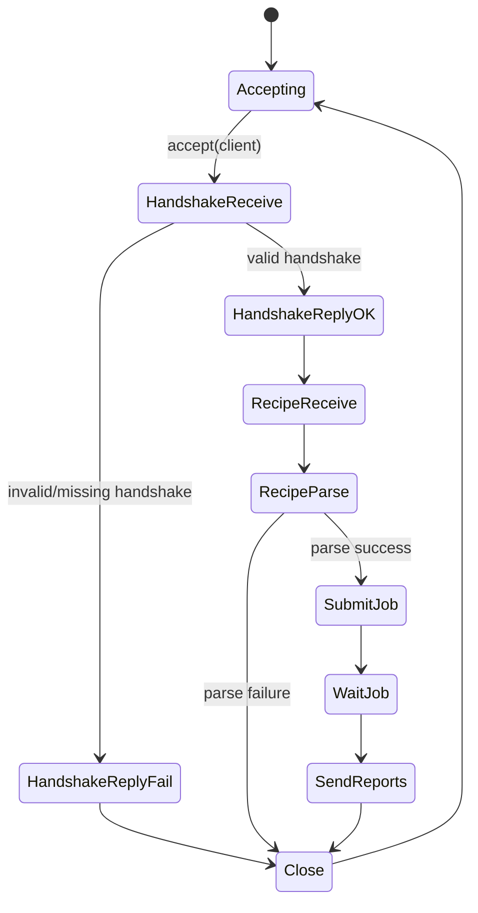
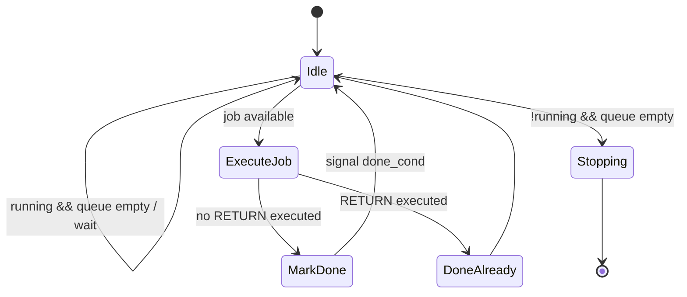
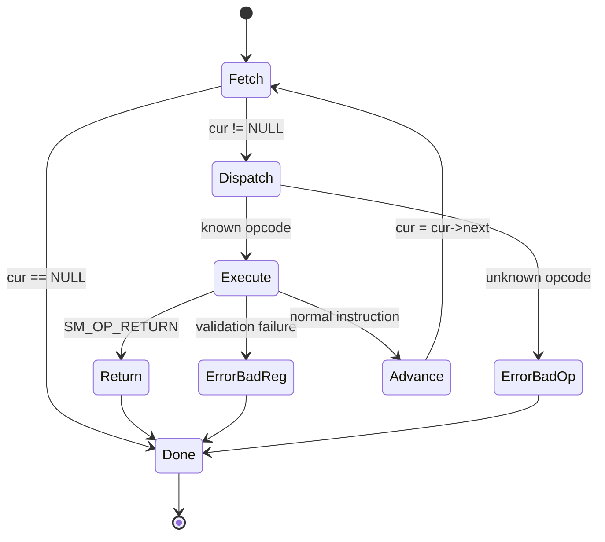

# State Machine Instruction Set and Finite State Machine Operation

## 1. Scope

This document extracts and explains the instruction set, JSON recipe format, virtual-machine execution model, threaded state-machine lifecycle, and daemon protocol behavior from the uploaded source files:

| Source file | Role |
|---|---|
| `state_machine(1).h` | Public VM API, opcode enum, register count, instruction and operand structs |
| `state_machine(1).c` | VM executor, opcode implementations, persistent worker thread, job queue, reporting |
| `protocol(1).h` | JSON parsing/building, handshake parsing, opcode-string mapping, recipe-to-instruction conversion |
| `fs_utils(1).h` | Filesystem, shell, path, random, hashing, and helper functions used by VM opcodes |
| `taskd(1).c` | Firecracker-friendly AF_VSOCK daemon that receives handshakes and recipes, runs the VM, and returns JSON |
| `sm_test.c` | Local test harness that loads `sample_recipe.json`, parses it, runs the VM, and prints reports |

Source line anchors used while extracting this document:

| Symbol / subsystem | Source location |
|---|---|
| `SM_REG_COUNT` | `state_machine(1).h:L7` |
| `sm_error` | `state_machine(1).h:L15` |
| `sm_opcode` | `state_machine(1).h:L22-L45` |
| `sm_instr` | `state_machine(1).h:L48-L52` |
| Operand structs | `state_machine(1).h:L55-L179` |
| VM context | `state_machine(1).c:L12-L15` |
| register validation | `state_machine(1).c:L41` |
| executor entry point | `state_machine(1).c:L56` |
| worker thread | `state_machine(1).c:L310` |
| public threaded API | `state_machine(1).c:L343-L425` |
| opcode string mapping | `protocol(1).h:L162-L199` |
| JSON recipe parser | `protocol(1).h:L203-L648` |
| raw JSON receive helper | `protocol(1).h:L131-L159` |
| daemon handshake/recipe loop | `taskd(1).c:L145-L208` |

---

## 2. High-Level Architecture

The system is a small recipe-driven virtual machine.

A recipe is received or loaded as JSON, parsed into a linked list of `sm_instr` nodes, and executed sequentially. Each instruction contains:

```c
typedef struct sm_instr {
  sm_opcode op;
  void *data;
  struct sm_instr *next;
} sm_instr;
```

The VM itself has:

```c
typedef struct sm_vm {
  sm_reg regs[SM_REG_COUNT];
  unsigned int seed;
} sm_vm;
```

`sm_reg` is defined as `void *`, and `SM_REG_COUNT` is `8`. Registers therefore store a mixture of:

- pointers to strings or buffers,
- booleans encoded as `(void *)(uintptr_t)0` or `(void *)(uintptr_t)1`,
- integers encoded through `uintptr_t`,
- `NULL` for failed operations or empty/unset values.

The core executor is `sm_execute(sm_instr *head, sm_vm *vm)`. It walks the linked list from `head` to the end, dispatching on `cur->op`. There is no explicit program counter beyond the linked-list pointer. There are no branch, jump, call, or loop instructions. The only control-flow instruction is `SM_OP_RETURN`, which terminates execution early.

The threaded wrapper creates a persistent worker thread with a FIFO job queue. Recipes are submitted to the worker via `sm_submit`, and callers block for completion using `sm_wait`.

---

## 3. Execution Model

### 3.1 VM State

| Field | Description |
|---|---|
| `regs[8]` | Fixed-width array of 8 generic `void *` registers. |
| `seed` | Unsigned integer RNG seed used by random instructions. |

### 3.2 Register Indexing

All register operands are integer indices and must satisfy:

```c
idx >= 0 && idx < SM_REG_COUNT
```

Because `SM_REG_COUNT` is `8`, valid register indices are:

```text
0, 1, 2, 3, 4, 5, 6, 7
```

Most instructions use the `CHECK_REG(...)` macro. If validation fails, the executor returns `SM_ERR_BAD_REG`.

### 3.3 Error Codes

```c
typedef enum {
  SM_ERR_NONE = 0,
  SM_ERR_BAD_REG = 1,
  SM_ERR_BAD_OP = 2,
  SM_ERR_INTERNAL = 3,
} sm_error;
```

| Error | Value | Meaning |
|---|---:|---|
| `SM_ERR_NONE` | `0` | Successful execution, unless overridden by `SM_OP_RETURN` job value. |
| `SM_ERR_BAD_REG` | `1` | Bad register index, missing operand data, invalid report count, or similar validation failure. |
| `SM_ERR_BAD_OP` | `2` | Unknown opcode in executor dispatch. |
| `SM_ERR_INTERNAL` | `3` | Internal failure, currently returned when `sm_execute` receives a `NULL` VM. |

### 3.4 Instruction Flow

The executor follows this algorithm:

```text
function sm_execute(head, vm):
    if vm is NULL:
        return SM_ERR_INTERNAL

    err = SM_ERR_NONE
    cur = head

    while cur is not NULL:
        switch cur->op:
            execute instruction
            on register/operand validation failure:
                err = SM_ERR_BAD_REG
                goto done
            on unknown opcode:
                err = SM_ERR_BAD_OP
                goto done
            on SM_OP_RETURN:
                signal completion if running in worker context
                terminate loop

        cur = cur->next

done:
    return err
```

### 3.5 Control Flow

The VM is linear. Instructions run in list order.

There are no conditional jumps. Boolean operations can compute truth values, but there is no built-in branch instruction that consumes them.

`SM_OP_RETURN` is the only early-termination mechanism. It sets the worker job value, marks the job done, signals `done_cond`, and stops execution.

### 3.6 Direct Execution vs Worker Execution

`sm_execute` can be called directly, but some behavior depends on thread-local `current_ctx`.

| Feature | Direct `sm_execute` | Worker-thread execution |
|---|---|---|
| Runs instructions | Yes | Yes |
| Uses registers/seed | Yes | Yes |
| `SM_OP_REPORT` callback | No, unless `current_ctx` is set | Yes, if callback registered |
| `SM_OP_RETURN` signals job completion | No | Yes |
| `sm_wait` usable | Not applicable | Yes |

The worker sets `current_ctx = ctx` before calling `sm_execute`, then clears it afterward.

---

## 4. JSON Recipe Format

### 4.1 Top-Level Shape

A recipe must be a JSON array.

```json
[
  {
    "op": "SM_OP_LOAD_CONST",
    "data": {
      "dest": 0,
      "value": "/tmp/example.txt"
    }
  },
  {
    "op": "SM_OP_RETURN",
    "data": {
      "value": 0
    }
  }
]
```

Each array element should be an object with:

| Field | Type | Description |
|---|---|---|
| `op` | string | Opcode name, such as `"SM_OP_FS_READ"`. |
| `data` | object | Opcode-specific operand object. |

### 4.2 Opcode Name Mapping

`protocol(1).h` maps string names to `sm_opcode` enum values. The accepted opcode strings are exactly:

```text
SM_OP_LOAD_CONST
SM_OP_FS_CREATE
SM_OP_FS_DELETE
SM_OP_FS_COPY
SM_OP_FS_MOVE
SM_OP_FS_WRITE
SM_OP_FS_READ
SM_OP_FS_UNPACK
SM_OP_FS_HASH
SM_OP_FS_LIST
SM_OP_SHELL
SM_OP_EQ
SM_OP_NOT
SM_OP_AND
SM_OP_OR
SM_OP_INDEX_SELECT
SM_OP_RANDOM_RANGE
SM_OP_PATH_JOIN
SM_OP_RANDOM_WALK
SM_OP_DIR_CONTAINS
SM_OP_RAND_SEED
SM_OP_REPORT
SM_OP_RETURN
```

### 4.3 Parser Behavior

`proto_parse_recipe`:

1. Parses the input as JSON.
2. Requires the top-level value to be an array.
3. Iterates array elements.
4. Skips elements that are not objects.
5. Requires `op` to be a string and `data` to be an object.
6. Skips elements whose `op` string is not recognized.
7. Allocates one `sm_instr` per recognized instruction.
8. Parses `data` into the matching operand struct.
9. Links instructions into a singly linked list.

Important implementation detail: for malformed operand data inside a recognized opcode, the parser often frees the partially allocated operand struct but still leaves the `sm_instr` allocated with `ins->data == NULL`, then appends it. At runtime, the executor's `CHECK_REG(...)` validation generally treats this as `SM_ERR_BAD_REG`.

### 4.4 JSON Number and String Handling

`SM_OP_LOAD_CONST` is special:

- If `data.value` is a JSON string, the parser duplicates it with `strdup` and stores the resulting pointer in the destination register.
- If `data.value` is a JSON number, the parser casts the integer value through `uintptr_t` and stores it as a register value.

All other instructions that take registers expect JSON numbers representing register indices.

### 4.5 Minimal Valid Recipe

```json
[
  {
    "op": "SM_OP_RETURN",
    "data": {
      "value": 0
    }
  }
]
```

### 4.6 Example: Write, Read, Report, Return

```json
[
  {
    "op": "SM_OP_LOAD_CONST",
    "data": { "dest": 0, "value": "/tmp/vm-example.txt" }
  },
  {
    "op": "SM_OP_LOAD_CONST",
    "data": { "dest": 1, "value": "hello from recipe\n" }
  },
  {
    "op": "SM_OP_LOAD_CONST",
    "data": { "dest": 2, "value": "w" }
  },
  {
    "op": "SM_OP_FS_WRITE",
    "data": { "dest": 3, "path": 0, "content": 1, "mode": 2 }
  },
  {
    "op": "SM_OP_FS_READ",
    "data": { "dest": 4, "path": 0 }
  },
  {
    "op": "SM_OP_REPORT",
    "data": { "regs": [3, 4] }
  },
  {
    "op": "SM_OP_RETURN",
    "data": { "value": 0 }
  }
]
```

Expected report shape:

```json
{"values":[1,"hello from recipe\n"]}
```

---

## 5. Instruction Set Summary

| Opcode | JSON `data` fields | Register inputs | Register output / effect |
|---|---|---|---|
| `SM_OP_LOAD_CONST` | `dest`, `value` | none | `regs[dest] = value` |
| `SM_OP_FS_CREATE` | `dest`, `path`, `type` | `path`, `type` | boolean success in `dest` |
| `SM_OP_FS_DELETE` | `dest`, `path` | `path` | boolean success in `dest` |
| `SM_OP_FS_COPY` | `dest`, `src`, `dst` | `src`, `dst` | boolean success in `dest` |
| `SM_OP_FS_MOVE` | `dest`, `src`, `dst` | `src`, `dst` | boolean success in `dest` |
| `SM_OP_FS_WRITE` | `dest`, `path`, `content`, `mode` | `path`, `content`, `mode` | boolean success in `dest` |
| `SM_OP_FS_READ` | `dest`, `path` | `path` | file contents pointer in `dest`, or `NULL` |
| `SM_OP_FS_UNPACK` | `tar_path`, `dest` | `tar_path`, `dest` | side effect only; no result register |
| `SM_OP_FS_HASH` | `dest`, `path` | `path` | hex XXH64 string pointer in `dest`, or `NULL` |
| `SM_OP_FS_LIST` | `dest`, `path` | `path` | newline-separated directory entries string in `dest`, or `NULL` |
| `SM_OP_SHELL` | `dest`, `cmd` | `cmd` | command stdout string in `dest`, or `NULL` |
| `SM_OP_EQ` | `dest`, `lhs`, `rhs` | `lhs`, `rhs` | boolean pointer/integer equality in `dest` |
| `SM_OP_NOT` | `dest`, `src` | `src` | boolean negation in `dest` |
| `SM_OP_AND` | `dest`, `lhs`, `rhs` | `lhs`, `rhs` | boolean AND in `dest` |
| `SM_OP_OR` | `dest`, `lhs`, `rhs` | `lhs`, `rhs` | boolean OR in `dest` |
| `SM_OP_INDEX_SELECT` | `dest`, `list`, `index` | `list`, `index` | selected newline-delimited list item string in `dest`, or `NULL` |
| `SM_OP_RANDOM_RANGE` | `dest`, `min`, `max` | `min`, `max` | random integer in inclusive range stored in `dest` |
| `SM_OP_PATH_JOIN` | `dest`, `base`, `name` | `base`, `name` | joined path string in `dest`, or `NULL` |
| `SM_OP_RANDOM_WALK` | `dest`, `root`, `depth` | `root`, `depth` | randomly walked directory path string in `dest`, or `NULL` |
| `SM_OP_DIR_CONTAINS` | `dest`, `a`, `b` | `a`, `b` | boolean result in `dest` |
| `SM_OP_RAND_SEED` | `seed` | none | sets VM RNG seed |
| `SM_OP_REPORT` | `regs` | listed registers | invokes report callback with JSON |
| `SM_OP_RETURN` | `value` | none | ends execution and sets worker job value |

---

## 6. Detailed Instruction Reference

### 6.1 `SM_OP_LOAD_CONST`

**JSON**

```json
{
  "op": "SM_OP_LOAD_CONST",
  "data": {
    "dest": 0,
    "value": "example"
  }
}
```

**Data struct**

```c
typedef struct {
  int dest;
  const void *value;
} sm_load_const;
```

**Semantics**

```text
regs[dest] = value
```

`value` may be a string or a number in JSON.

- JSON string: duplicated with `strdup`.
- JSON number: cast to `(void *)(uintptr_t)valueint`.

**Validation**

- `dest` must be a valid register index.
- `value` must be a string or number.

---

### 6.2 `SM_OP_FS_CREATE`

**JSON**

```json
{
  "op": "SM_OP_FS_CREATE",
  "data": {
    "dest": 2,
    "path": 0,
    "type": 1
  }
}
```

**Data struct**

```c
typedef struct {
  int dest;
  int path;
  int type;
} sm_fs_create;
```

**Register inputs**

| Register | Expected value |
|---|---|
| `path` | string path |
| `type` | string type |

**Semantics**

```text
p = (char *)regs[path]
t = (char *)regs[type]
regs[dest] = fs_create(p, t)
```

`fs_create` behavior:

- If `type == "dir"`, calls `mkdir(path, 0755)`.
- Otherwise creates a regular file using `open(path, O_WRONLY | O_CREAT | O_EXCL, 0644)`.
- Returns `false` if `path` or `type` is `NULL`.

**Output**

Boolean success stored as `0` or `1`.

---

### 6.3 `SM_OP_FS_DELETE`

**JSON**

```json
{
  "op": "SM_OP_FS_DELETE",
  "data": {
    "dest": 1,
    "path": 0
  }
}
```

**Data struct**

```c
typedef struct {
  int dest;
  int path;
} sm_fs_delete;
```

**Semantics**

```text
p = (char *)regs[path]
regs[dest] = fs_delete(p)
```

`fs_delete` behavior:

- Rejects `NULL`.
- Rejects the root path `/`.
- Rejects an empty string path.
- Uses `lstat` to inspect the path.
- Recursively deletes directories via `nftw(..., FTW_DEPTH | FTW_PHYS)`.
- Deletes files/symlinks using `unlink`.

**Output**

Boolean success.

---

### 6.4 `SM_OP_FS_COPY`

**JSON**

```json
{
  "op": "SM_OP_FS_COPY",
  "data": {
    "dest": 3,
    "src": 0,
    "dst": 1
  }
}
```

**Data struct**

```c
typedef struct {
  int dest;
  int src;
  int dst;
} sm_fs_copy;
```

**Semantics**

```text
s = (char *)regs[src]
d = (char *)regs[dst]
regs[dest] = fs_copy(s, d)
```

`fs_copy` behavior:

- Uses `lstat(src)`.
- Recursively copies directories.
- Copies regular files with an 8192-byte buffer.
- Preserves the source file mode when creating destination files.
- Returns `false` on stat/open/read/write/mkdir errors.

**Output**

Boolean success.

---

### 6.5 `SM_OP_FS_MOVE`

**JSON**

```json
{
  "op": "SM_OP_FS_MOVE",
  "data": {
    "dest": 3,
    "src": 0,
    "dst": 1
  }
}
```

**Data struct**

```c
typedef struct {
  int dest;
  int src;
  int dst;
} sm_fs_move;
```

**Semantics**

```text
s = (char *)regs[src]
d = (char *)regs[dst]
regs[dest] = fs_move(s, d)
```

`fs_move` behavior:

1. Tries `rename(src, dest)`.
2. If `rename` fails with `EXDEV`, it copies then deletes the source.
3. Otherwise returns `false`.

**Output**

Boolean success.

---

### 6.6 `SM_OP_FS_WRITE`

**JSON**

```json
{
  "op": "SM_OP_FS_WRITE",
  "data": {
    "dest": 4,
    "path": 0,
    "content": 1,
    "mode": 2
  }
}
```

**Data struct**

```c
typedef struct {
  int dest;
  int path;
  int content;
  int mode;
} sm_fs_write;
```

**Register inputs**

| Register | Expected value |
|---|---|
| `path` | string path |
| `content` | string content |
| `mode` | `fopen` mode string, such as `"w"` or `"a"` |

**Semantics**

```text
p = (char *)regs[path]
c = (char *)regs[content]
m = (char *)regs[mode]
regs[dest] = fs_write(p, c, m)
```

`fs_write` calls `fopen(path, mode)` and writes `strlen(content)` bytes.

**Output**

Boolean success.

---

### 6.7 `SM_OP_FS_READ`

**JSON**

```json
{
  "op": "SM_OP_FS_READ",
  "data": {
    "dest": 1,
    "path": 0
  }
}
```

**Data struct**

```c
typedef struct {
  int dest;
  int path;
} sm_fs_read;
```

**Semantics**

```text
p = (char *)regs[path]
regs[dest] = fs_read(p)
```

`fs_read` behavior:

- Opens the file in binary mode.
- Seeks to end to determine size.
- Allocates `size + 1` bytes.
- Reads the entire file.
- NUL-terminates the buffer.
- Returns `NULL` on error.

**Output**

Heap-allocated file-content string, or `NULL`.

---

### 6.8 `SM_OP_FS_UNPACK`

**JSON**

```json
{
  "op": "SM_OP_FS_UNPACK",
  "data": {
    "tar_path": 0,
    "dest": 1
  }
}
```

**Data struct**

```c
typedef struct {
  int tar_path;
  int dest;
} sm_fs_unpack;
```

**Register inputs**

| Register | Expected value |
|---|---|
| `tar_path` | string tar archive path |
| `dest` | string destination directory |

**Semantics**

```text
t = (char *)regs[tar_path]
d = (char *)regs[dest]
if t and d:
    fs_unpack(t, d)
```

`fs_unpack` runs:

```sh
tar -xf '<tar_path>' -C '<dest>'
```

**Output**

No register is updated with the boolean result. The return value of `fs_unpack` is ignored by the VM instruction.

---

### 6.9 `SM_OP_FS_HASH`

**JSON**

```json
{
  "op": "SM_OP_FS_HASH",
  "data": {
    "dest": 1,
    "path": 0
  }
}
```

**Data struct**

```c
typedef struct {
  int dest;
  int path;
} sm_fs_hash;
```

**Semantics**

```text
p = (char *)regs[path]
regs[dest] = fs_hash(p)
```

`fs_hash` behavior:

- Opens the file in binary mode.
- Computes XXH64 with seed `0`.
- Returns a heap-allocated 16-character lowercase hexadecimal string.
- Returns `NULL` on error.

**Output**

Hash string, or `NULL`.

---

### 6.10 `SM_OP_FS_LIST`

**JSON**

```json
{
  "op": "SM_OP_FS_LIST",
  "data": {
    "dest": 1,
    "path": 0
  }
}
```

**Data struct**

```c
typedef struct {
  int dest;
  int path;
} sm_fs_list;
```

**Semantics**

```text
p = (char *)regs[path]
regs[dest] = fs_list_dir(p)
```

`fs_list_dir` behavior:

- Opens a directory.
- Skips `.` and `..`.
- Appends each entry name followed by `\n`.
- Returns `""` for an empty directory.
- Returns `NULL` on error.

**Output**

Heap-allocated newline-separated list string, or `NULL`.

---

### 6.11 `SM_OP_SHELL`

**JSON**

```json
{
  "op": "SM_OP_SHELL",
  "data": {
    "dest": 1,
    "cmd": 0
  }
}
```

**Data struct**

```c
typedef struct {
  int dest;
  int cmd;
} sm_shell;
```

**Semantics**

```text
c = (char *)regs[cmd]
regs[dest] = fs_exec(c)
```

`fs_exec` behavior:

- Runs the command using `popen(cmd, "r")`.
- Captures stdout only.
- Grows an output buffer dynamically.
- Returns a NUL-terminated string.
- Returns `NULL` on error.

**Output**

Heap-allocated stdout string, or `NULL`.

---

### 6.12 `SM_OP_EQ`

**JSON**

```json
{
  "op": "SM_OP_EQ",
  "data": {
    "dest": 2,
    "lhs": 0,
    "rhs": 1
  }
}
```

**Data struct**

```c
typedef struct {
  int dest;
  int lhs;
  int rhs;
} sm_eq;
```

**Semantics**

```text
l = (uintptr_t)regs[lhs]
r = (uintptr_t)regs[rhs]
regs[dest] = (l == r)
```

This compares raw register values, not string contents.

**Output**

Boolean result.

---

### 6.13 `SM_OP_NOT`

**JSON**

```json
{
  "op": "SM_OP_NOT",
  "data": {
    "dest": 1,
    "src": 0
  }
}
```

**Data struct**

```c
typedef struct {
  int dest;
  int src;
} sm_not;
```

**Semantics**

```text
v = ((uintptr_t)regs[src] != 0)
regs[dest] = !v
```

**Output**

Boolean result.

---

### 6.14 `SM_OP_AND`

**JSON**

```json
{
  "op": "SM_OP_AND",
  "data": {
    "dest": 2,
    "lhs": 0,
    "rhs": 1
  }
}
```

**Data struct**

```c
typedef struct {
  int dest;
  int lhs;
  int rhs;
} sm_and;
```

**Semantics**

```text
l = ((uintptr_t)regs[lhs] != 0)
r = ((uintptr_t)regs[rhs] != 0)
regs[dest] = l && r
```

**Output**

Boolean result.

---

### 6.15 `SM_OP_OR`

**JSON**

```json
{
  "op": "SM_OP_OR",
  "data": {
    "dest": 2,
    "lhs": 0,
    "rhs": 1
  }
}
```

**Data struct**

```c
typedef struct {
  int dest;
  int lhs;
  int rhs;
} sm_or;
```

**Semantics**

```text
l = ((uintptr_t)regs[lhs] != 0)
r = ((uintptr_t)regs[rhs] != 0)
regs[dest] = l || r
```

**Output**

Boolean result.

---

### 6.16 `SM_OP_INDEX_SELECT`

**JSON**

```json
{
  "op": "SM_OP_INDEX_SELECT",
  "data": {
    "dest": 2,
    "list": 0,
    "index": 1
  }
}
```

**Data struct**

```c
typedef struct {
  int dest;
  int list;
  int index;
} sm_index_select;
```

**Register inputs**

| Register | Expected value |
|---|---|
| `list` | newline-separated string |
| `index` | integer encoded in register |

**Semantics**

```text
list = (char *)regs[list]
idx = (size_t)(uintptr_t)regs[index]
regs[dest] = list_index(list, idx)
```

`list_index` returns the zero-based `idx`th line of the list, allocating a new string. If the index is out of range, it returns `NULL`.

**Output**

Heap-allocated selected item string, or `NULL`.

---

### 6.17 `SM_OP_RANDOM_RANGE`

**JSON**

```json
{
  "op": "SM_OP_RANDOM_RANGE",
  "data": {
    "dest": 2,
    "min": 0,
    "max": 1
  }
}
```

**Data struct**

```c
typedef struct {
  int dest;
  int min;
  int max;
} sm_random_range;
```

**Semantics**

```text
min = (long)(uintptr_t)regs[min]
max = (long)(uintptr_t)regs[max]
seed_apply(vm->seed)
val = rand_range(min, max)
regs[dest] = val
vm->seed = next_seed(vm->seed)
```

`rand_range`:

- Swaps `min` and `max` if `max < min`.
- Returns an inclusive random value in `[min, max]`.
- Uses C library `rand()`.
- If the range overflows or is invalid, returns `min`.

`next_seed` uses:

```text
new_seed = old_seed * 1664525 + 1013904223
```

**Output**

Integer encoded as a register value.

---

### 6.18 `SM_OP_PATH_JOIN`

**JSON**

```json
{
  "op": "SM_OP_PATH_JOIN",
  "data": {
    "dest": 2,
    "base": 0,
    "name": 1
  }
}
```

**Data struct**

```c
typedef struct {
  int dest;
  int base;
  int name;
} sm_path_join;
```

**Semantics**

```text
base = (char *)regs[base]
name = (char *)regs[name]
regs[dest] = path_join(base, name)
```

`path_join`:

- Allocates a new string.
- Adds `/` between `base` and `name` if `base` does not already end with `/`.

**Output**

Heap-allocated path string, or `NULL`.

---

### 6.19 `SM_OP_RANDOM_WALK`

**JSON**

```json
{
  "op": "SM_OP_RANDOM_WALK",
  "data": {
    "dest": 2,
    "root": 0,
    "depth": 1
  }
}
```

**Data struct**

```c
typedef struct {
  int dest;
  int root;
  int depth;
} sm_random_walk;
```

**Semantics**

```text
root = (char *)regs[root]
depth = (int)(uintptr_t)regs[depth]
seed_apply(vm->seed)
regs[dest] = fs_random_walk(root, depth)
vm->seed = next_seed(vm->seed)
```

`fs_random_walk`:

1. Starts at `root`.
2. For each step up to `depth`:
   - Lists current directory.
   - Filters entries to directories.
   - Randomly selects one directory.
   - Moves into it.
3. Stops early if no subdirectories exist.
4. Returns the final path.

**Output**

Heap-allocated path string, or `NULL`.

---

### 6.20 `SM_OP_DIR_CONTAINS`

**JSON**

```json
{
  "op": "SM_OP_DIR_CONTAINS",
  "data": {
    "dest": 2,
    "a": 0,
    "b": 1
  }
}
```

**Data struct**

```c
typedef struct {
  int dest;
  int dir_a;
  int dir_b;
} sm_dir_contains;
```

**Semantics**

```text
ap = (char *)regs[dir_a]
bp = (char *)regs[dir_b]
regs[dest] = fs_dir_contains(ap, bp)
```

The JSON field names are `a` and `b`; the C struct fields are `dir_a` and `dir_b`.

`fs_dir_contains(a, b)` recursively checks whether every entry in directory tree `a` exists at the corresponding location in tree `b`.

Important details:

- If `a` is a directory, `b` must also be a directory.
- For files, it only checks that the corresponding path exists in `b`.
- It does not compare file contents.
- It does not compare file metadata beyond directory-vs-non-directory structure.

**Output**

Boolean result.

---

### 6.21 `SM_OP_RAND_SEED`

**JSON**

```json
{
  "op": "SM_OP_RAND_SEED",
  "data": {
    "seed": 12345
  }
}
```

**Data struct**

```c
typedef struct {
  unsigned int seed;
} sm_rand_seed;
```

**Semantics**

```text
vm->seed = seed
seed_apply(vm->seed)
```

`seed_apply` calls `srand(seed)`.

**Output**

No register output.

---

### 6.22 `SM_OP_REPORT`

**JSON**

```json
{
  "op": "SM_OP_REPORT",
  "data": {
    "regs": [0, 1, 2]
  }
}
```

**Data struct**

```c
typedef struct {
  int count;
  int regs[SM_REG_COUNT];
} sm_report;
```

**Validation**

- `regs` must be a JSON array.
- Array length must be greater than `0`.
- Array length must be at most `SM_REG_COUNT` (`8`).
- Each item must be a number.

**Semantics**

If running inside a worker context and a report callback is registered:

1. Creates a JSON object.
2. Creates an array called `values`.
3. Iterates the requested registers.
4. Skips invalid register indices.
5. Converts each value:
   - if numeric value `< 4096`, emits a JSON number;
   - otherwise, treats the value as a C string pointer and emits a JSON string.
6. Calls the registered callback with compact JSON.

Example output:

```json
{"values":[1,"/tmp/file.txt","content"]}
```

**Output**

No register output. The side effect is a callback invocation.

---

### 6.23 `SM_OP_RETURN`

**JSON**

```json
{
  "op": "SM_OP_RETURN",
  "data": {
    "value": 0
  }
}
```

**Data struct**

```c
typedef struct {
  int value;
} sm_return;
```

**Semantics**

```text
val = data ? data->value : 0

if current_ctx exists:
    lock current_ctx
    current_ctx->job_value = val
    current_ctx->job_done = true
    signal done_cond
    unlock current_ctx

terminate execution loop
```

**Output**

No register output. Sets the worker job value and terminates execution.

---

## 7. Worker Thread and Job Queue

### 7.1 Context Structure

The runtime context contains:

| Field | Purpose |
|---|---|
| `vm` | Persistent VM register/seed state shared across submitted jobs. |
| `head`, `tail` | FIFO linked-list job queue. |
| `lock` | Mutex protecting queue and completion fields. |
| `cond` | Condition variable used to wake the worker when a job arrives. |
| `done_cond` | Condition variable used to wake waiters when a job finishes. |
| `job_done` | Boolean completion flag for the active/latest job. |
| `job_value` | Completion value from `SM_OP_RETURN` or executor error. |
| `report_cb`, `report_ud` | Report callback and user pointer. |
| `thread` | Worker thread handle. |
| `running` | Worker lifecycle flag. |

### 7.2 Lifecycle API

```c
sm_ctx *sm_thread_start(void);
void sm_thread_stop(sm_ctx *ctx);
bool sm_submit(sm_ctx *ctx, sm_instr *chain);
sm_reg sm_get_reg(sm_ctx *ctx, int idx);
void sm_wait(sm_ctx *ctx, int *value);
void sm_set_report_cb(sm_ctx *ctx, sm_report_cb cb, void *user);
```

### 7.3 `sm_thread_start`

Behavior:

1. Allocates and zero-initializes `sm_ctx`.
2. Initializes mutex and condition variables.
3. Sets `running = true`.
4. Starts `sm_worker` in a new pthread.
5. Returns the context pointer, or `NULL` on failure.

### 7.4 `sm_submit`

Behavior:

1. Allocates an `sm_job`.
2. Stores the instruction-chain pointer in the job.
3. Appends the job to the FIFO queue.
4. Sets `job_done = false`.
5. Signals the worker condition variable.

### 7.5 `sm_worker`

Worker loop:

```text
while true:
    lock ctx
    wait while running and queue is empty
    if not running and queue empty:
        unlock and exit

    pop one job from queue
    job_done = false
    unlock ctx

    current_ctx = ctx
    exec_ret = sm_execute(job->instr, &ctx->vm)
    current_ctx = NULL

    lock ctx
    if job_done is false:
        job_value = exec_ret
        job_done = true
        signal done_cond
    unlock ctx

    free job node
```

If an instruction executes `SM_OP_RETURN`, the job may already be marked done before `sm_execute` returns. If not, the worker uses the executor return code as the job value.

### 7.6 `sm_wait`

`sm_wait` blocks until `job_done` is true, then copies `job_value` into the caller-provided output pointer.

### 7.7 Persistent VM State

The same `sm_vm` lives inside `sm_ctx` for the lifetime of the thread. Registers and seed are not automatically cleared between jobs. A later job can observe values left by a previous job unless it overwrites them.

---

## 8. Reporting Model

### 8.1 Callback Signature

```c
typedef void (*sm_report_cb)(const char *json, void *user);
```

Reports are emitted only when:

1. `SM_OP_REPORT` is executed,
2. `current_ctx` is non-`NULL`, and
3. `current_ctx->report_cb` is non-`NULL`.

### 8.2 Local Test Harness Reporting

`sm_test.c` registers a callback that prints each report JSON object to stdout.

Execution flow:

1. Reads `sample_recipe.json`.
2. Parses it with `proto_parse_recipe`.
3. Starts the state-machine thread.
4. Registers `report_cb`.
5. Submits the recipe.
6. Waits for completion.
7. Stops the thread.
8. Prints `return <value>`.

### 8.3 Daemon Reporting

`taskd.c` registers a callback that parses each report JSON string and appends it to a response JSON array. After the job finishes, the daemon appends a status object and sends the whole array back to the client.

Example response shape:

```json
[
  {"values":[1,"some output"]},
  {"values":["another report"]},
  {"status":0}
]
```

---

## 9. Daemon / Protocol Operation

### 9.1 Daemon Startup

`taskd` expects one command-line argument:

```text
taskd <vsock-port>
```

Startup sequence:

1. Parses the VSOCK port.
2. Double-forks and daemonizes.
3. Starts the persistent state-machine thread.
4. Creates an `AF_VSOCK` stream socket.
5. Binds to `VMADDR_CID_ANY` and the requested port.
6. Listens with backlog `32`.
7. Accepts one connection at a time.

### 9.2 Handshake

The first client message must be raw JSON accepted by `parse_handshake`.

Expected shape:

```json
{
  "hello": "anything",
  "version": 1
}
```

The parser only validates that:

- `hello` is a string,
- `version` is a number.

It copies the values into a `handshake_msg`, but the daemon does not check the greeting value or version compatibility beyond successful parsing.

Daemon handshake response:

```json
{"status":0}
```

or:

```json
{"status":-1}
```

The daemon sends this response with a trailing NUL byte.

If the handshake fails, the daemon closes the connection.

### 9.3 Recipe Receive and Execution

After a successful handshake:

1. Daemon receives a raw JSON string.
2. Parses it with `proto_parse_recipe`.
3. Creates a JSON array for response collection.
4. Registers a report-collection callback.
5. Submits the recipe to the persistent VM thread.
6. Waits for job completion.
7. Clears the report callback.
8. Appends `{"status":0}` to the response array.
9. Sends the compact JSON array back to the client.
10. Closes the connection.

### 9.4 Message Framing

`proto_recv_json` reads from the socket in 4096-byte chunks and stops when `recv` returns fewer bytes than the chunk size.

There is no explicit length prefix, delimiter, or streaming JSON parser. This means message boundaries depend on socket read behavior. A peer that sends an exact multiple of 4096 bytes or keeps the connection open may cause the receiver to wait for more data.

---

## 10. Filesystem Utility Semantics Used by Instructions

### 10.1 Creation

```text
fs_create(path, "dir") -> mkdir(path, 0755)
fs_create(path, other) -> open(path, O_WRONLY | O_CREAT | O_EXCL, 0644)
```

### 10.2 Deletion

`fs_delete` refuses:

- `NULL`,
- `/`,
- `""`.

Directories are recursively deleted using `nftw` with depth-first traversal and physical-walk behavior.

### 10.3 Copy

`fs_copy` copies files or recursively copies directories. Directory copying creates destination directories with the source mode and recurses through entries except `.` and `..`.

### 10.4 Move

`fs_move` first tries `rename`. On cross-device failure (`EXDEV`), it falls back to copy-then-delete.

### 10.5 Read and Write

`fs_read` loads an entire file into memory. `fs_write` writes a NUL-terminated string using `fopen` mode supplied by the recipe.

### 10.6 Directory Listing

`fs_list_dir` returns a newline-separated string of entry names and omits `.` and `..`.

### 10.7 Hash

`fs_hash` computes XXH64 over a file and returns a 16-character hex string.

### 10.8 Shell Execution

`fs_exec` uses `popen(cmd, "r")` and captures stdout.

### 10.9 Unpack

`fs_unpack` executes a shell command:

```sh
tar -xf '<tar_path>' -C '<dest>'
```

### 10.10 Random Walk

`fs_random_walk(root, depth)` randomly descends through subdirectories for up to `depth` steps.

### 10.11 Directory Contains

`fs_dir_contains(a, b)` checks whether all paths present under `a` have corresponding paths under `b`. It does not verify file content equality.

---

## 11. Type and Value Conventions

### 11.1 Booleans

Boolean outputs are stored as small integer pointer values:

```c
vm->regs[dest] = (void *)(uintptr_t)ok;
```

In reports, these appear as JSON numbers because values below `4096` are emitted as numbers.

### 11.2 Integers

Integers are stored through `uintptr_t`:

```c
vm->regs[dest] = (void *)(uintptr_t)val;
```

They are read back with casts such as:

```c
long min = (long)(uintptr_t)vm->regs[a->min];
```

### 11.3 Strings

Strings are raw `char *` pointers. They can come from:

- duplicated JSON constants,
- file reads,
- hashes,
- directory listings,
- shell output,
- path joining,
- list selection,
- random walk.

### 11.4 Report Value Heuristic

`SM_OP_REPORT` decides whether a register is numeric or string-like by checking:

```text
if value < 4096:
    emit JSON number
else:
    emit JSON string using value as char *
```

This is heuristic and not type-safe.

---

## 12. Operational FSM View

Although the instruction executor itself is a linear VM rather than a classic state-transition table, the surrounding daemon and worker form finite-state workflows.

### 12.1 Daemon Connection FSM



### 12.2 Worker Thread FSM



### 12.3 Instruction Executor FSM



---

## 13. Security and Robustness Notes

These notes are extracted from behavior visible in the code and are important for operators or maintainers.

### 13.1 Recipes Can Execute Shell Commands

`SM_OP_SHELL` executes arbitrary shell commands through `popen`.

`SM_OP_FS_UNPACK` also constructs and executes a shell command through `system`.

Recipes should be treated as privileged code unless sandboxed.

### 13.2 Path Quoting in `fs_unpack`

`fs_unpack` wraps paths in single quotes but does not escape embedded single quotes. A crafted path containing `'` may break the intended command quoting.

### 13.3 Message Framing Is Implicit

`proto_recv_json` relies on receiving a short read to determine message end. There is no length prefix. This can cause blocking or truncation in some stream behaviors.

### 13.4 Register Values Are Untyped

All registers are `void *`. The VM relies on each instruction interpreting registers correctly. Passing a numeric register where a string is expected can lead to invalid pointer dereferences.

### 13.5 Report Conversion Is Heuristic

`SM_OP_REPORT` treats values below `4096` as numbers and values at or above `4096` as strings. Invalid pointer-like values can cause undefined behavior when reported.

### 13.6 Memory Is Not Reclaimed Per Instruction

Many instructions allocate strings and store them in registers. The visible code does not provide a destructor for recipes, operand structs, duplicated constants, or allocated register values. Long-running operation may leak memory.

### 13.7 Persistent Registers Across Jobs

The daemon uses one persistent state-machine context. Registers are not cleared between jobs. A new recipe can observe previous register contents unless it overwrites them.

### 13.8 Daemon Ignores Return Value in Final Status

The daemon waits for the job but appends `{"status":0}` after completion rather than reporting the actual `SM_OP_RETURN` value or executor error code.

---

## 14. Suggested Reference Schema

This is an informal schema that describes accepted recipe structure.

```json
{
  "type": "array",
  "items": {
    "type": "object",
    "required": ["op", "data"],
    "properties": {
      "op": {
        "type": "string",
        "enum": [
          "SM_OP_LOAD_CONST",
          "SM_OP_FS_CREATE",
          "SM_OP_FS_DELETE",
          "SM_OP_FS_COPY",
          "SM_OP_FS_MOVE",
          "SM_OP_FS_WRITE",
          "SM_OP_FS_READ",
          "SM_OP_FS_UNPACK",
          "SM_OP_FS_HASH",
          "SM_OP_FS_LIST",
          "SM_OP_SHELL",
          "SM_OP_EQ",
          "SM_OP_NOT",
          "SM_OP_AND",
          "SM_OP_OR",
          "SM_OP_INDEX_SELECT",
          "SM_OP_RANDOM_RANGE",
          "SM_OP_PATH_JOIN",
          "SM_OP_RANDOM_WALK",
          "SM_OP_DIR_CONTAINS",
          "SM_OP_RAND_SEED",
          "SM_OP_REPORT",
          "SM_OP_RETURN"
        ]
      },
      "data": {
        "type": "object"
      }
    }
  }
}
```

Opcode-specific `data` shapes:

```text
SM_OP_LOAD_CONST    { dest: reg, value: string|number }
SM_OP_FS_CREATE     { dest: reg, path: reg, type: reg }
SM_OP_FS_DELETE     { dest: reg, path: reg }
SM_OP_FS_COPY       { dest: reg, src: reg, dst: reg }
SM_OP_FS_MOVE       { dest: reg, src: reg, dst: reg }
SM_OP_FS_WRITE      { dest: reg, path: reg, content: reg, mode: reg }
SM_OP_FS_READ       { dest: reg, path: reg }
SM_OP_FS_UNPACK     { tar_path: reg, dest: reg }
SM_OP_FS_HASH       { dest: reg, path: reg }
SM_OP_FS_LIST       { dest: reg, path: reg }
SM_OP_SHELL         { dest: reg, cmd: reg }
SM_OP_EQ            { dest: reg, lhs: reg, rhs: reg }
SM_OP_NOT           { dest: reg, src: reg }
SM_OP_AND           { dest: reg, lhs: reg, rhs: reg }
SM_OP_OR            { dest: reg, lhs: reg, rhs: reg }
SM_OP_INDEX_SELECT  { dest: reg, list: reg, index: reg }
SM_OP_RANDOM_RANGE  { dest: reg, min: reg, max: reg }
SM_OP_PATH_JOIN     { dest: reg, base: reg, name: reg }
SM_OP_RANDOM_WALK   { dest: reg, root: reg, depth: reg }
SM_OP_DIR_CONTAINS  { dest: reg, a: reg, b: reg }
SM_OP_RAND_SEED     { seed: number }
SM_OP_REPORT        { regs: reg[] }
SM_OP_RETURN        { value: number }
```

Where:

```text
reg = integer in [0, 7]
```

---

## 15. Quick Authoring Guide

### 15.1 Load Constants First

Most filesystem and shell instructions expect string registers. Use `SM_OP_LOAD_CONST` before invoking them.

```json
{
  "op": "SM_OP_LOAD_CONST",
  "data": { "dest": 0, "value": "/tmp/file.txt" }
}
```

### 15.2 Reuse Registers Deliberately

Registers are limited to 8 slots. It is safe to overwrite registers, but be aware that old heap allocations are not freed.

### 15.3 Add Reports for Observability

Use `SM_OP_REPORT` to return intermediate results.

```json
{
  "op": "SM_OP_REPORT",
  "data": { "regs": [0, 1, 2] }
}
```

### 15.4 End With Return

Recipes should normally end with `SM_OP_RETURN`.

```json
{
  "op": "SM_OP_RETURN",
  "data": { "value": 0 }
}
```

Without `SM_OP_RETURN`, the worker reports the executor error code as the job value. In daemon mode, however, the final response still appends `{"status":0}` after a parsed and submitted recipe completes.

---

## 16. Complete Example Recipe

This example creates a directory, writes a file, reads it back, reports the creation/write/read results, and returns success.

```json
[
  {
    "op": "SM_OP_LOAD_CONST",
    "data": { "dest": 0, "value": "/tmp/sm-demo" }
  },
  {
    "op": "SM_OP_LOAD_CONST",
    "data": { "dest": 1, "value": "dir" }
  },
  {
    "op": "SM_OP_FS_CREATE",
    "data": { "dest": 2, "path": 0, "type": 1 }
  },
  {
    "op": "SM_OP_LOAD_CONST",
    "data": { "dest": 3, "value": "hello.txt" }
  },
  {
    "op": "SM_OP_PATH_JOIN",
    "data": { "dest": 4, "base": 0, "name": 3 }
  },
  {
    "op": "SM_OP_LOAD_CONST",
    "data": { "dest": 5, "value": "Hello from the state machine\n" }
  },
  {
    "op": "SM_OP_LOAD_CONST",
    "data": { "dest": 6, "value": "w" }
  },
  {
    "op": "SM_OP_FS_WRITE",
    "data": { "dest": 7, "path": 4, "content": 5, "mode": 6 }
  },
  {
    "op": "SM_OP_FS_READ",
    "data": { "dest": 6, "path": 4 }
  },
  {
    "op": "SM_OP_REPORT",
    "data": { "regs": [2, 7, 4, 6] }
  },
  {
    "op": "SM_OP_RETURN",
    "data": { "value": 0 }
  }
]
```

Potential report:

```json
{"values":[1,1,"/tmp/sm-demo/hello.txt","Hello from the state machine\n"]}
```

---

## 17. One-Page Summary

The VM is an 8-register, linear, linked-list instruction executor. Recipes are JSON arrays of `{ "op": "...", "data": {...} }` objects. The parser converts recognized opcode strings into `sm_instr` nodes and opcode-specific operand structs. The executor validates register indices, dispatches each opcode, stores results back into registers, and advances to the next instruction. `SM_OP_RETURN` ends execution. The persistent worker thread runs submitted recipes from a FIFO queue and supports JSON reports through a callback. The daemon wraps this system behind an AF_VSOCK protocol with a simple JSON handshake and recipe message.
